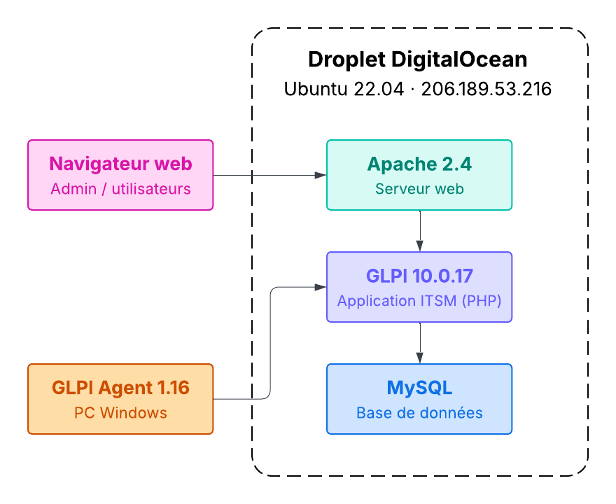

  

<h1 align="center">Déploiement GLPI 10</h1>

  
  
  
  
  
  

  Déploiement complet d'une instance GLPI 10 sur serveur cloud (DigitalOcean), avec inventaire automatisé via GLPI Agent et gestion de tickets selon le cycle de vie ITIL.

---

## Contexte

Mise en place d'une solution de gestion de parc informatique et de helpdesk pour une structure ne disposant d'aucun outil ITSM. Le déploiement couvre l'ensemble de la chaîne : provisionnement du serveur, installation de la stack applicative, activation de l'inventaire automatique, configuration des profils utilisateurs, et démonstration d'un cycle de vie complet de tickets d'incident.

## Stack technique

| Composant | Technologie |
|-----------|------------|
| Serveur | DigitalOcean Droplet — Ubuntu 22.04 LTS (Francfort) |
| Serveur web | Apache 2.4 |
| Base de données | MySQL 8.0 (utf8mb4_unicode_ci) |
| Langage serveur | PHP 8.1 |
| Application | GLPI 10.0.17 (Teclib, licence GPL) |
| Agent d'inventaire | GLPI Agent 1.16 (service Windows, MSI) |
| Accès | `http://206.189.53.216` |

## Architecture

  

## Fonctionnalités démontrées

| Fonctionnalité | Détail |
|---------------|--------|
| Inventaire automatique | Remontée hardware/software du poste Windows via GLPI Agent (processeur, RAM, OS, logiciels installés) |
| Gestion d'actifs | Fiche matériel enrichie : utilisateur assigné, localisation, statut |
| Helpdesk ITIL | Portail self-service, création de tickets par l'utilisateur final |
| Cycle de vie ticket | Nouveau → En cours (attribué) → Résolu, avec suivi et solution documentée |
| Profils utilisateurs | Super-Admin, Technicien, Self-Service — ségrégation des accès vérifiée |
| Statistiques | Tableau de bord Assistance → Statistics avec historique d'activité |

## Veille technologique : inventaire natif vs FusionInventory

Les supports de formation référencent **FusionInventory**, plugin historique utilisé avec GLPI 9.x. Depuis la sortie de GLPI 10 (juin 2022), cette fonctionnalité a été **intégrée nativement** au cœur de l'application. FusionInventory n'est plus maintenu pour les versions actuelles et son usage est déconseillé par l'éditeur.

Ce projet utilise donc le **GLPI Agent** (successeur officiel, maintenu par Teclib) et l'inventaire natif de GLPI 10 — un choix délibéré issu d'une démarche de veille technologique.

## Fichiers de configuration

- [`config/glpi.conf`](config/glpi.conf) — VirtualHost Apache (DocumentRoot vers `/public/`, mod_rewrite)
- [`config/agent.cfg`](config/agent.cfg) — Configuration GLPI Agent (URL serveur, port interface locale)